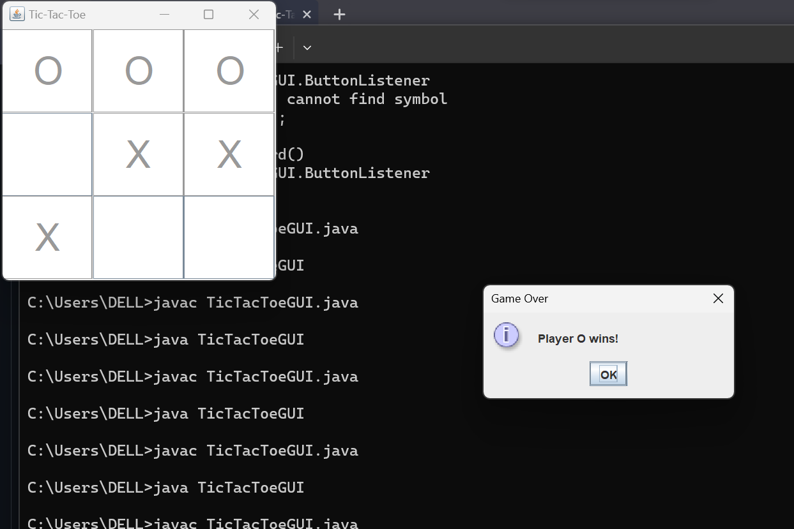

# Java Tic-Tac-Toe Game

This is a Java implementation of the classic Tic-Tac-Toe game. It provides a console-based interface for playing the game, either against a friend or against a computer AI opponent.

## Features

- Play against a friend
- Simple and intuitive console-based interface.
- Clear display of the game board after each move.

## How to Play

1. Clone this repository to your local machine.
2. Navigate to the project directory in your terminal.
3. Compile the Java source code: `javac Main.java`
4. Run the compiled program: `java Main`
5. Follow the on-screen instructions to start a new game and make your moves.
6. Input your moves using the format `row column` (e.g., `1 2` for the first row and second column).
7. The game will alternate between X and O players.
8. The game ends when one player wins or there's a draw.

Enjoy the game and happy coding! 🎮🚀
